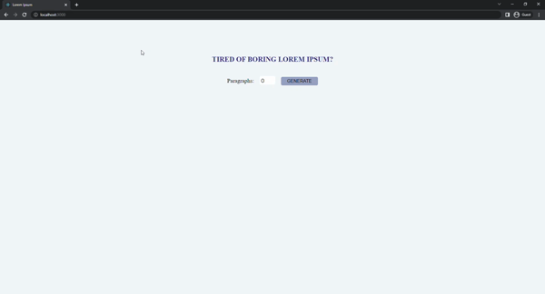

# Lorem Ipsum
The paragraph is generated until the number of entered in the field of input in this project. If the number is smaller than or equal to 0, one paragraph is generated. If the number is bigger than 8, eight paragraphs are generated.



## Used Technologies
* 

* 

* 

## Installation
First clone the project.
```
git clone https://github.com/saglamburcu/react-lorem-ipsum.git
```

## Usage
After cloning the project, open it in Visual Studio Code.
```
cd react-lorem-ipsum
code .
```
Download node modules to make it work
```
npm install
```
To make it work
```
npm start
```